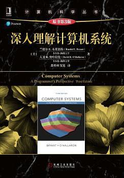

# Introduction to Computer Systems -- ICS 

B站视频： `https://www.bilibili.com/video/av31289365`

实验资源： `http://csapp.cs.cmu.edu/3e/labs.html`

课程资源： `http://www.cs.cmu.edu/afs/cs/academic/class/15213-f15/www/index.html`

卡耐基梅隆大学的公开课，教材是CSAPP，教课的老师是CSAPP的作者。

---

# 任务：

整个CMU 15-213的核心是下面是7个实验：

`Data Lab、Bomb Lab、Attack Lab、Cache Lab、Shell Lab、Malloc Lab、Proxy Lab`

Programs and Data -- 程序和数据

* datalab: 操纵bits。
* bomblab: 拆解二进制炸弹。
* attacklab: 代码注入攻击基础。

The Memory Hierarchy -- 内存层次结构

* cachelab: 设计一个Cache模拟器，并优化

Exceptional Control Flow -- 异常控制流

* tshlab: 写一个自己的shell

Virtual Memory -- 虚拟内存

* malloclab: 写一个自己的malloc包

Networking, and Concurrency -- 网络与并发

* proxylab: 写一个自己的Web proxy

（看完lab的我，感觉被按在地上摩擦，orz）

简书参考文章lab介绍： `https://www.jianshu.com/p/601101b9d4e4`

后面的一些文章，我大都会在最后附上我看到的一些好的博客地址，强烈推荐大家看看

---

# CSAPP章节简介

（个人观点，具体介绍看相关`.md`） 

## 第一章 -- 计算机系统漫游

快速看过有个大致了解，毕竟后面的章节才是重点

## 第二章 -- 信息表示和处理

补码等肯定要了解，浮点数表示有点难，自己看得比较简略

## 第三章 -- 程序的机器级表示 

这一章都可以单独出书的，太炫酷了，和本科汇编课程最大的两点区别就是

1. 这个课程这一部分使用的是ATT标准的x86-64汇编
2. 这个课程从C语言到汇编的角度来讲，非常有条理而且实用。

## 第四章 -- 处理器体系结构

这一章太底层了，ICS也没有讲，跳过。

## 第五章 -- 优化程序性能

又是一非常好的章节，非常炫酷。

---

所以我也是CSAPP的粉丝了，如果你觉得CSAPP还有大部分不能理解，那先学习从其它相关渠道学习吧，如果小部分不能理解，又感觉书比较无聊（其实书高潮迭起，非常有趣，之所以这么厚也不是因为啰嗦，而是讲的深入浅出）那就和视频一起学习吧。

